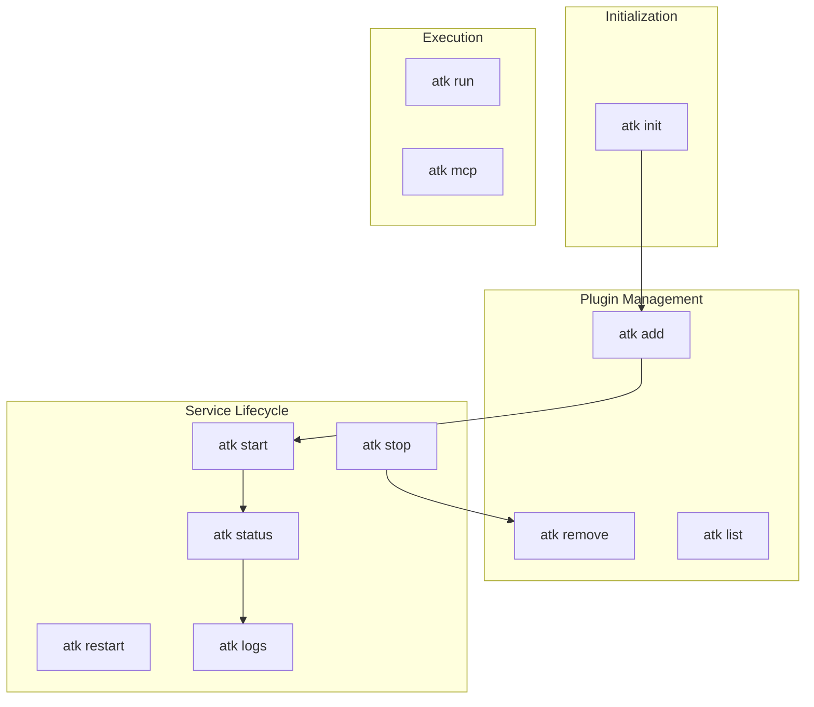

# ATK Commands Specification

> **Status**: Approved
> **Last Updated**: 2026-01-23

## Overview

This document specifies all ATK CLI commands, their parameters, behavior, and error handling.

## ATK Home Location

ATK Home is resolved in this order:

1. `ATK_HOME` environment variable (if set)
2. Default: `~/.atk/`

All commands that require ATK Home check this resolution order.

## Exit Codes

All commands use consistent exit codes:

| Code | Name | Meaning |
|------|------|---------|
| 0 | SUCCESS | Operation completed successfully |
| 1 | GENERAL_ERROR | Unexpected error |
| 2 | INVALID_ARGS | Invalid arguments or usage error |
| 3 | HOME_NOT_INITIALIZED | ATK Home not initialized (run `atk init` first) |
| 4 | PLUGIN_NOT_FOUND | Plugin not found in manifest or filesystem |
| 5 | PLUGIN_INVALID | Plugin file invalid (YAML parse error, schema violation) |
| 6 | DOCKER_ERROR | Docker/container operation failed |
| 7 | GIT_ERROR | Git operation failed |

## Command Flow



---

## Commands

### `atk init`

Initialize ATK Home directory.

**Usage:**
```bash
atk init              # Initialize at ~/.atk/ (or ATK_HOME if set)
atk init ./my-atk     # Initialize at custom path
```

**Behavior:**
1. Resolve target directory (argument > ATK_HOME > ~/.atk/)
2. If target exists and is valid ATK Home → no-op, exit 0
3. If target exists but invalid → exit 1 with error message
4. Create directory structure:
   - `<target>/`
   - `<target>/manifest.yaml` (empty plugins list, `auto_commit: true`)
   - `<target>/plugins/`
   - `<target>/.gitignore` (with `*.env` pattern)
5. Initialize git repository
6. Create initial commit: "Initialize ATK Home"

**Exit Codes:**
- 0: Success (including no-op when already initialized)
- 1: Directory exists but is not valid ATK Home

---

### `atk add <source>`

Add a plugin to ATK Home.

**Usage:**
```bash
atk add ./path/to/plugin-dir    # Directory containing plugin.yaml
atk add ./my-plugin.yaml        # Single plugin.yaml file
```

**Parameters:**

| Parameter | Required | Description |
|-----------|----------|-------------|
| `source` | Yes | Local path to directory (containing plugin.yaml) or plugin.yaml file |

**Source Types (MVP):**

| Source | Example | Behavior |
|--------|---------|----------|
| Directory | `atk add ./openmemory/` | Copies entire directory to plugins/ |
| Single file | `atk add ./mcp-server.yaml` | Creates plugin dir, copies only the yaml |

**Behavior:**
1. Validate ATK Home is initialized (exit 3 if not)
2. Determine source type (directory or single file)
3. Validate source exists and contains/is valid `plugin.yaml` (exit 5 if invalid)
4. Parse plugin.yaml, extract display name
5. Generate directory name from display name (sanitized)
6. Copy plugin files to `<ATK_HOME>/plugins/<directory>/`:
   - **Directory source**: copy entire directory contents
   - **Single file source**: create directory, copy only plugin.yaml
7. Add entry to manifest: `{name: "<display>", directory: "<sanitized>"}`
8. If directory already exists → **overwrite without confirmation** (recovery scenario)
9. Run `install` lifecycle event (if defined in plugin.yaml)
10. Commit changes (if `auto_commit: true`)

**Exit Codes:**
- 0: Success
- 3: ATK Home not initialized
- 5: Plugin source invalid or plugin.yaml missing/invalid
- 7: Git commit failed

**Note:** Git URL sources are deferred to post-MVP (Phase 4).

---

### `atk remove <plugin>`

Remove a plugin from ATK Home.

**Usage:**
```bash
atk remove openmemory
```

**Parameters:**

| Parameter | Required | Description |
|-----------|----------|-------------|
| `plugin` | Yes | Plugin directory name |

**Behavior:**
1. Validate ATK Home is initialized (exit 3 if not)
2. Find plugin by directory name in manifest (exit 4 if not found)
3. Run `stop` lifecycle event (stop containers gracefully)
4. Remove plugin directory from `~/.atk/plugins/`
5. Remove entry from manifest
6. Commit changes (if `auto_commit: true`)

**Exit Codes:**
- 0: Success
- 3: ATK Home not initialized
- 4: Plugin not found
- 6: Failed to stop containers
- 7: Git commit failed

---

## `atk start <plugin>`

Start a plugin's service.

**Arguments:**
- `<plugin>`: Plugin name or directory (required, unless `--all`)
- `--all`: Start all plugins in manifest order

**Behavior:**
1. Validate ATK Home exists
2. Find plugin by name or directory
3. Call plugin's `start` lifecycle event (script or container start)
4. Report result

**Lifecycle Event:**
- Calls `start` script if present in plugin directory
- Plugin-agnostic: implementation details depend on plugin type (Docker, native, etc.)

**Notes:**
- Order matters when using `--all` (respects manifest order)
- Plugins without `start` script: skip with warning

**Exit Codes:**
- 0: Success (all requested plugins started)
- 3: ATK Home not initialized
- 4: Plugin not found
- 6: Service start failed

---

## `atk stop <plugin>`

Stop a plugin's service.

**Arguments:**
- `<plugin>`: Plugin name or directory (required, unless `--all`)
- `--all`: Stop all plugins in reverse manifest order

**Behavior:**
1. Validate ATK Home exists
2. Find plugin by name or directory
3. Call plugin's `stop` lifecycle event
4. Report result

**Lifecycle Event:**
- Calls `stop` script if present in plugin directory
- Plugin-agnostic: implementation details depend on plugin type

**Notes:**
- When using `--all`, stops in reverse manifest order (dependency-friendly)
- Plugins without `stop` script: skip with warning

**Exit Codes:**
- 0: Success (all requested plugins stopped)
- 3: ATK Home not initialized
- 4: Plugin not found
- 6: Service stop failed

---

## `atk restart <plugin>`

Restart a plugin's service.

**Arguments:**
- `<plugin>`: Plugin name or directory (required, unless `--all`)
- `--all`: Restart all plugins

**Behavior:**
1. Validate ATK Home exists
2. Find plugin by name or directory
3. Call plugin's `restart` lifecycle event (or stop + start if no restart script)
4. Report result

**Lifecycle Event:**
- Calls `restart` script if present, otherwise calls `stop` then `start`
- Plugin-agnostic: implementation details depend on plugin type

**Notes:**
- Fallback to stop+start is automatic if no `restart` script exists
- When using `--all`: stop all (reverse order), then start all (manifest order)

**Exit Codes:**
- 0: Success
- 3: ATK Home not initialized
- 4: Plugin not found
- 6: Service restart failed

---

## `atk status [plugin]`

Show status of plugin(s).

**Arguments:**
- `[plugin]`: Plugin name or directory (optional)
- If omitted: show status of all plugins

**Behavior:**
1. Validate ATK Home exists
2. If plugin specified: find and show status for that plugin
3. If no plugin: iterate all plugins and show status for each
4. Call plugin's `status` lifecycle event to get current state

**Output Format:**
For each plugin, display:
- Plugin name (display name from manifest)
- Directory name
- Status (running, stopped, error, unknown)
- Ports (if applicable)
- Unset required variables count
- Unset optional variables count

**Lifecycle Event:**
- Calls `status` script if present in plugin directory
- Plugin-agnostic: each plugin defines how to report its status

**Notes:**
- This is a "costly" operation (may query containers, processes, etc.)
- For a quick list of plugins, use `atk list` instead

**Exit Codes:**
- 0: Success
- 3: ATK Home not initialized
- 4: Plugin not found (when specific plugin requested)

---

## `atk logs <plugin>`

View logs for a plugin's service.

**Arguments:**
- `<plugin>`: Plugin name or directory (required)
- (Future: `--follow`, `--tail`, etc.)

**Behavior:**
1. Validate ATK Home exists
2. Find plugin by name or directory
3. Call plugin's `logs` lifecycle event
4. Stream/display log output

**Lifecycle Event:**
- Calls `logs` script if present in plugin directory
- Plugin-agnostic: each plugin defines how to retrieve its logs

**Exit Codes:**
- 0: Success
- 3: ATK Home not initialized
- 4: Plugin not found
- 6: Failed to retrieve logs

---

## `atk run <plugin> <script>`

Run a custom script defined by a plugin.

**Arguments:**
- `<plugin>`: Plugin name or directory (required)
- `<script>`: Script name to run (required)

**Behavior:**
1. Validate ATK Home exists
2. Find plugin by name or directory
3. Look for script file in plugin directory root (not a scripts/ subdirectory)
4. Execute the script
5. Pass through exit code from script

**Notes:**
- Scripts live in plugin root directory, not in a subdirectory
- Script must be executable
- ATK passes through the script's exit code

**Exit Codes:**
- 0: Success (script exited 0)
- 3: ATK Home not initialized
- 4: Plugin not found
- 5: Script not found or not executable
- (other): Script's own exit code passed through

---

## `atk mcp <plugin>`

Display MCP (Model Context Protocol) configuration for a plugin.

**Arguments:**
- `<plugin>`: Plugin name or directory (required)

**Behavior:**
1. Validate ATK Home exists
2. Find plugin by name or directory
3. Read plugin's MCP configuration
4. Output in format suitable for inclusion in MCP config files

**Notes:**
- Output format designed for copy-paste into client MCP configurations
- Shows resolved values (environment variables substituted where applicable)

**Exit Codes:**
- 0: Success
- 3: ATK Home not initialized
- 4: Plugin not found
- 5: Plugin has no MCP configuration

---

# Deferred to Future

The following commands and features are documented in `atk-future.md`:

- `atk list` — fast manifest-only listing (use `atk status` for MVP)
- `atk doctor` — validate ATK Home structure
- `atk config` — view/edit manifest configuration
- `--json` output flag for all commands
- Verbosity flags (`-v`, `-q`)
