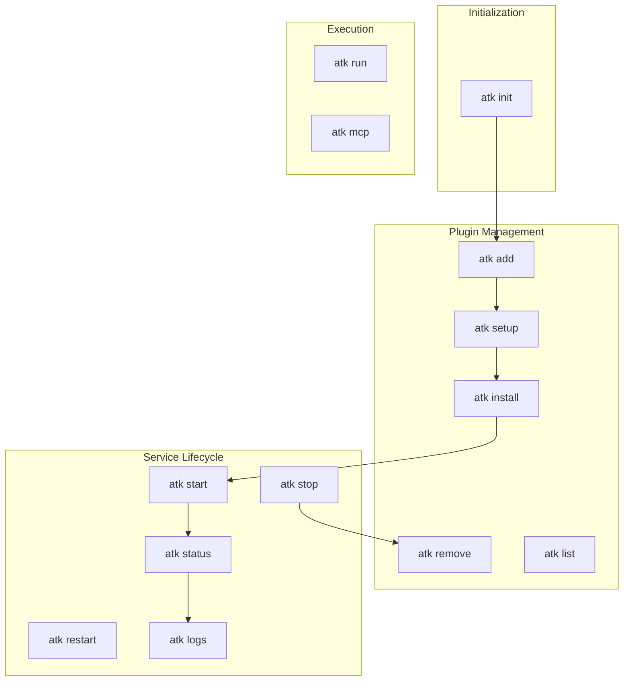

# ATK Commands Specification

> **Status**: Approved
> **Last Updated**: 2026-01-29

## Overview

This document specifies all ATK CLI commands, their parameters, behavior, and error handling.

## ATK Home Location

ATK Home is resolved in this order:

1. `ATK_HOME` environment variable (if set)
2. Default: `~/.atk/`

All commands that require ATK Home check this resolution order.

## Exit Codes

All commands use consistent exit codes:

| Code | Name | Meaning |
|------|------|---------|
| 0 | SUCCESS | Operation completed successfully |
| 1 | GENERAL_ERROR | Unexpected error |
| 2 | INVALID_ARGS | Invalid arguments or usage error |
| 3 | HOME_NOT_INITIALIZED | ATK Home not initialized (run `atk init` first) |
| 4 | PLUGIN_NOT_FOUND | Plugin not found in manifest or filesystem |
| 5 | PLUGIN_INVALID | Plugin file invalid (YAML parse error, schema violation) |
| 6 | DOCKER_ERROR | Docker/container operation failed |
| 7 | GIT_ERROR | Git operation failed |
| 8 | ENV_NOT_CONFIGURED | Required environment variables not set (run `atk setup` first) |
| 9 | PORT_CONFLICT | Declared port already in use (stop conflicting service first) |

## Command Flow



---

## Commands

### `atk init`

Initialize ATK Home directory.

**Usage:**
```bash
atk init              # Initialize at ~/.atk/ (or ATK_HOME if set)
atk init ./my-atk     # Initialize at custom path
```

**Behavior:**
1. Resolve target directory (argument > ATK_HOME > ~/.atk/)
2. If target exists and is valid ATK Home → no-op, exit 0
3. If target exists but invalid → exit 1 with error message
4. Create directory structure:
   - `<target>/`
   - `<target>/manifest.yaml` (empty plugins list, `auto_commit: true`)
   - `<target>/plugins/`
   - `<target>/.gitignore` (with `*.env` pattern)
5. Initialize git repository
6. Create initial commit: "Initialize ATK Home"

**Exit Codes:**
- 0: Success (including no-op when already initialized)
- 1: Directory exists but is not valid ATK Home

---

### `atk add <source>`

Add a plugin to ATK Home.

**Usage:**
```bash
atk add ./path/to/plugin-dir    # Directory containing plugin.yaml
atk add ./my-plugin.yaml        # Single plugin.yaml file
```

**Parameters:**

| Parameter | Required | Description |
|-----------|----------|-------------|
| `source` | Yes | Local path to directory (containing plugin.yaml) or plugin.yaml file |

**Source Types (MVP):**

| Source | Example | Behavior |
|--------|---------|----------|
| Directory | `atk add ./openmemory/` | Copies entire directory to plugins/ |
| Single file | `atk add ./mcp-server.yaml` | Creates plugin dir, copies only the yaml |

**Behavior:**
1. Validate ATK Home is initialized (exit 3 if not)
2. Determine source type (directory or single file)
3. Validate source exists and contains/is valid `plugin.yaml` (exit 5 if invalid)
4. Parse plugin.yaml, extract display name
5. Generate directory name from display name (sanitized)
6. Copy plugin files to `<ATK_HOME>/plugins/<directory>/`:
   - **Directory source**: copy entire directory contents
   - **Single file source**: create directory, copy only plugin.yaml
7. Add entry to manifest: `{name: "<display>", directory: "<sanitized>"}`
8. If directory already exists → **overwrite without confirmation** (recovery scenario)
9. Run `install` lifecycle event (if defined in plugin.yaml)
10. Commit changes (if `auto_commit: true`)

**Exit Codes:**
- 0: Success
- 3: ATK Home not initialized
- 5: Plugin source invalid or plugin.yaml missing/invalid
- 7: Git commit failed

**Note:** Git URL sources are deferred to post-MVP (Phase 4).

---

### `atk remove <plugin>`

Remove a plugin from ATK Home.

**Usage:**
```bash
atk remove openmemory
```

**Parameters:**

| Parameter | Required | Description |
|-----------|----------|-------------|
| `plugin` | Yes | Plugin directory name |

**Behavior:**
1. Validate ATK Home is initialized (exit 3 if not)
2. Find plugin by directory name in manifest (exit 4 if not found)
3. Run `stop` lifecycle event (stop containers gracefully)
4. Remove plugin directory from `~/.atk/plugins/`
5. Remove entry from manifest
6. Commit changes (if `auto_commit: true`)

**Exit Codes:**
- 0: Success
- 3: ATK Home not initialized
- 4: Plugin not found
- 6: Failed to stop containers
- 7: Git commit failed

---

## `atk install [plugin]`

Run the install lifecycle command for plugin(s). For bootstrap scenarios, also fetches plugin files.

**Use Cases:**
1. **Re-run install**: After plugin files changed locally (pulls new images, rebuilds containers)
2. **Bootstrap**: Set up all plugins on a new machine after `git clone` of ATK Home

**Arguments:**
- `[plugin]`: Plugin name or directory (optional if `--all`)

**Flags:**
- `--all`: Install all plugins in manifest order

**Usage:**
```bash
atk install langfuse       # Run install lifecycle for one plugin
atk install --all          # Bootstrap: fetch plugins + run install for all
```

**Behavior:**

For single plugin (`atk install <plugin>`):
1. Validate ATK Home is initialized (exit 3 if not)
2. Find plugin by name or directory
3. Check required environment variables are set (exit 8 if missing)
4. Run `install` lifecycle command from plugin.yaml
5. If `install` not defined → skip silently (no-op)
6. Report output to user

For all plugins (`atk install --all`):
1. Validate ATK Home is initialized (exit 3 if not)
2. For each plugin in manifest:
   - If plugin files missing: fetch from source at pinned version
   - Check required environment variables are set
   - Run `install` lifecycle command
3. Continue on failure, report summary at end

**Workflow Clarification:**
- `atk add` = add new plugin from source + prompt for env vars + run install
- `atk upgrade` = fetch latest from source + update manifest + run install
- `atk setup` = prompt for env vars only (for configuring existing plugins)
- `atk install` = run install lifecycle (single) or bootstrap (--all)

**Exit Codes:**
- 0: Success (including no-op when install not defined)
- 3: ATK Home not initialized
- 4: Plugin not found
- 6: Install command failed
- 8: Required environment variables not set (run `atk setup` first)

---

## `atk setup [plugin]`

Configure environment variables for plugin(s) via interactive prompts.

**Use Cases:**
1. **New machine bootstrap**: After cloning ATK Home, set up all missing env vars
2. **Reconfigure**: Change or update env vars for a plugin
3. **First-time setup**: Called automatically during `atk add`

**Arguments:**
- `[plugin]`: Plugin name or directory (optional if `--all`)

**Flags:**
- `--all`: Set up all plugins that have env vars defined

**Usage:**
```bash
atk setup langfuse        # Configure one plugin
atk setup --all           # Configure all plugins (new machine scenario)
```

**Behavior:**
1. Validate ATK Home is initialized (exit 3 if not)
2. Find plugin(s) by name or directory
3. For each env var declared in plugin.yaml:
   - Show current value (masked for secrets) if already set
   - Show default value if defined
   - Prompt user for input (password input for secrets)
   - User can press Enter to keep existing value or accept default
4. Save values to plugin's `.env` file
5. Report completion

**Notes:**
- Designed for human interaction (prompts for input)
- Secrets are masked in prompts but stored in plain text in `.env`

**Exit Codes:**
- 0: Success
- 3: ATK Home not initialized
- 4: Plugin not found

---

## `atk start <plugin>`

Start a plugin's service.

**Arguments:**
- `<plugin>`: Plugin name or directory (required, unless `--all`)
- `--all`: Start all plugins in manifest order

**Behavior:**
1. Validate ATK Home exists
2. Find plugin by name or directory
3. Check required environment variables are set (exit 8 if missing)
4. Check for port conflicts (exit 9 if any declared port is in use)
5. Call plugin's `start` lifecycle event (script or container start)
6. Report result

**Lifecycle Event:**
- Calls `start` script if present in plugin directory
- Plugin-agnostic: implementation details depend on plugin type (Docker, native, etc.)
- Environment variables from `.env` file are injected into the command environment

**Notes:**
- Order matters when using `--all` (respects manifest order)
- Plugins without `start` script: skip with warning
- Port conflicts are fatal — use `atk restart` which stops first, then starts

**Exit Codes:**
- 0: Success (all requested plugins started)
- 3: ATK Home not initialized
- 4: Plugin not found
- 6: Service start failed
- 8: Required environment variables not set
- 9: Port conflict (declared port already in use)

---

## `atk stop <plugin>`

Stop a plugin's service.

**Arguments:**
- `<plugin>`: Plugin name or directory (required, unless `--all`)
- `--all`: Stop all plugins in reverse manifest order

**Behavior:**
1. Validate ATK Home exists
2. Find plugin by name or directory
3. Call plugin's `stop` lifecycle event
4. Report result

**Lifecycle Event:**
- Calls `stop` script if present in plugin directory
- Plugin-agnostic: implementation details depend on plugin type

**Notes:**
- When using `--all`, stops in reverse manifest order (dependency-friendly)
- Plugins without `stop` script: skip with warning

**Exit Codes:**
- 0: Success (all requested plugins stopped)
- 3: ATK Home not initialized
- 4: Plugin not found
- 6: Service stop failed

---

## `atk restart <plugin>`

Restart a plugin's service by stopping then starting it.

**Arguments:**
- `<plugin>`: Plugin name or directory (required, unless `--all`)
- `--all`: Restart all plugins

**Behavior:**
1. Validate ATK Home exists
2. Find plugin by name or directory
3. Call `stop` lifecycle event
4. Call `start` lifecycle event (includes env var and port checks)
5. Report result

**Notes:**
- Always executes stop then start — there is no separate `restart` lifecycle command
- This ensures port availability is verified before starting
- When using `--all`: stop all (reverse order), then start all (manifest order)
- Environment variables and port conflicts are checked during the start phase

**Exit Codes:**
- 0: Success
- 3: ATK Home not initialized
- 4: Plugin not found
- 6: Service stop or start failed
- 8: Required environment variables not set
- 9: Port conflict (should not happen if stop succeeded)

---

## `atk status [plugin]`

Show status of plugin(s).

**Arguments:**
- `[plugin]`: Plugin name or directory (optional)
- If omitted: show status of all plugins

**Behavior:**
1. Validate ATK Home exists
2. If plugin specified: find and show status for that plugin
3. If no plugin: iterate all plugins and show status for each
4. Call plugin's `status` lifecycle event to get current state

**Output Format:**
For each plugin, display:
- Plugin name (display name from manifest)
- Directory name
- Status (running, stopped, error, unknown)
- Ports (if applicable)
- Missing required variables (listed explicitly by name)
- Count of unset optional variables

**Lifecycle Event:**
- Calls `status` script if present in plugin directory
- Plugin-agnostic: each plugin defines how to report its status

**Notes:**
- This is a "costly" operation (may query containers, processes, etc.)
- For a quick list of plugins, use `atk list` instead

**Exit Codes:**
- 0: Success
- 3: ATK Home not initialized
- 4: Plugin not found (when specific plugin requested)

---

## `atk logs <plugin>`

View logs for a plugin's service.

**Arguments:**
- `<plugin>`: Plugin name or directory (required)
- (Future: `--follow`, `--tail`, etc.)

**Behavior:**
1. Validate ATK Home exists
2. Find plugin by name or directory
3. Call plugin's `logs` lifecycle event
4. Stream/display log output

**Lifecycle Event:**
- Calls `logs` script if present in plugin directory
- Plugin-agnostic: each plugin defines how to retrieve its logs

**Exit Codes:**
- 0: Success
- 3: ATK Home not initialized
- 4: Plugin not found
- 6: Failed to retrieve logs

---

## `atk run <plugin> <script>`

Run a custom script defined by a plugin.

**Arguments:**
- `<plugin>`: Plugin name or directory (required)
- `<script>`: Script name to run (required)

**Behavior:**
1. Validate ATK Home exists
2. Find plugin by name or directory
3. Look for script file in plugin directory root (not a scripts/ subdirectory)
4. Execute the script
5. Pass through exit code from script

**Notes:**
- Scripts live in plugin root directory, not in a subdirectory
- Script must be executable
- ATK passes through the script's exit code

**Exit Codes:**
- 0: Success (script exited 0)
- 3: ATK Home not initialized
- 4: Plugin not found
- 5: Script not found or not executable
- (other): Script's own exit code passed through

---

## `atk mcp <plugin>`

Generate MCP (Model Context Protocol) configuration JSON for a plugin.

**Arguments:**
- `<plugin>`: Plugin name or directory (required)

**Usage:**
```bash
atk mcp openmemory          # Output MCP config JSON for openmemory
```

**Behavior:**
1. Validate ATK Home exists
2. Find plugin by name or directory
3. Read plugin's MCP configuration from plugin.yaml
4. Resolve environment variable values from `.env` file
5. Output JSON in MCP standard format

**Output Format:**
```json
{
  "plugin-name": {
    "command": "docker",
    "args": ["exec", "-i", "container", "npx", "@org/mcp-server"],
    "env": {
      "API_KEY": "resolved-value-from-env-file"
    }
  }
}
```

**Notes:**
- Output follows MCP standard JSON format for client configuration
- Environment variables are resolved from `.env` file and substituted
- If required env vars are missing, outputs with placeholder `<NOT_SET>` and warns
- Plugin name is used as the server identifier key

**Exit Codes:**
- 0: Success
- 3: ATK Home not initialized
- 4: Plugin not found
- 5: Plugin has no MCP configuration defined

---

## `atk upgrade [plugin]`

Update plugin(s) to the latest version from their source.

**Arguments:**
- `[plugin]`: Plugin name or directory (optional if `--all`)

**Flags:**
- `--all`: Upgrade all plugins to latest versions

**Usage:**
```bash
atk upgrade openmemory    # Update one plugin to latest
atk upgrade --all         # Update all plugins to latest
```

**Behavior:**
1. Validate ATK Home is initialized (exit 3 if not)
2. Find plugin(s) by name or directory
3. Fetch latest plugin definition from source (registry or git)
4. Update manifest with new source reference (commit hash)
5. Replace plugin files (preserving `custom/` directory)
6. If new required env vars exist, run setup prompts
7. Run `install` lifecycle command
8. Commit changes (if `auto_commit: true`)

**Notes:**
- Only works on already-installed plugins
- Fetches from the source recorded in manifest
- User customizations in `custom/` are preserved
- This is the primary way to update plugins after initial installation

**Exit Codes:**
- 0: Success
- 3: ATK Home not initialized
- 4: Plugin not found
- 6: Install command failed
- 7: Git commit failed

---

# Deferred to Future

The following commands and features are documented in `atk-future.md`:

- `atk list` — fast manifest-only listing (use `atk status` for MVP)
- `atk doctor` — validate ATK Home structure
- `atk config` — view/edit manifest configuration
- `--json` output flag for all commands
- Verbosity flags (`-v`, `-q`)
