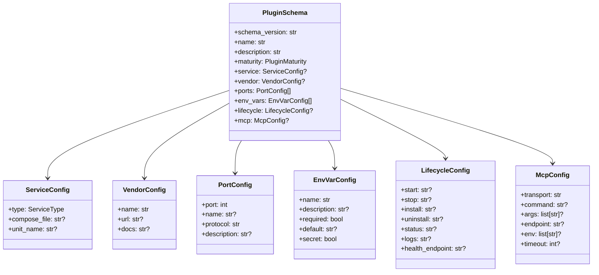

# Plugin Schema Design

> **Status**: Draft — awaiting review

This document defines the design principles, structure, and versioning strategy for ATK plugin YAML files.

## Design Principles

1. **Declarative over Imperative** — The schema describes *what* the plugin is, not *how* to install it. ATK derives behavior from declarations.

2. **Minimal Required Fields** — Only `schema_version`, `name`, and `description` are mandatory. Everything else has sensible defaults or is optional.

3. **Convention over Configuration** — Common patterns (Docker Compose lifecycle, port exposure) work without explicit configuration.

4. **Explicit over Magic** — When configuration is needed, it's clear and unambiguous. No hidden behaviors.

5. **Forward Compatible** — Schema versions are additive. Old plugins work with new ATK versions.

6. **Human and Machine Readable** — YAML is easy to write by hand and parse programmatically.

7. **Idempotent Operations** — `atk install` converges to the desired state: it creates if missing, updates if different. Running `atk install` twice produces the same result. There is no separate "update" command — install *is* update.

## Schema Versioning

**Format**: `YYYY-MM-DD` (AWS-style date versioning)

**Rules**:
- Version represents the schema definition date
- ATK maintains backward compatibility with older schema versions
- Breaking changes require a new schema version
- ATK validates against the declared `schema_version`

**Example**:
```yaml
schema_version: "2026-01-22"
```

**Compatibility Promise**:
- Additions (new optional fields) — same schema version
- Deprecations — announced, old version continues to work
- Removals/breaking changes — new schema version required

## Schema Structure


```mermaid
classDiagram
    class PluginSchema {
        +schema_version: str
        +name: str
        +description: str
        +maturity: PluginMaturity
        +service: ServiceConfig?
        +vendor: VendorConfig?
        +ports: PortConfig[]
        +env_vars: EnvVarConfig[]
        +lifecycle: LifecycleConfig?
        +mcp: McpConfig?
    }
    
    class ServiceConfig {
        +type: ServiceType
        +compose_file: str?
        +unit_name: str?
    }
    
    class VendorConfig {
        +name: str
        +url: str?
        +docs: str?
    }
    
    class PortConfig {
        +port: int
        +name: str?
        +protocol: str
        +description: str?
    }
    
    class EnvVarConfig {
        +name: str
        +description: str?
        +required: bool
        +default: str?
        +secret: bool
    }
    
    class LifecycleConfig {
        +start: str?
        +stop: str?
        +install: str?
        +uninstall: str?
        +status: str?
        +logs: str?
        +health_endpoint: str?
    }
    
    class McpConfig {
        +transport: str
        +command: str?
        +args: list[str]?
        +endpoint: str?
        +env: list[str]?
        +timeout: int?
    }
    
    PluginSchema --> ServiceConfig
    PluginSchema --> VendorConfig
    PluginSchema --> PortConfig
    PluginSchema --> EnvVarConfig
    PluginSchema --> LifecycleConfig
    PluginSchema --> McpConfig
```

## Field Specifications

### Root Fields

| Field | Type | Required | Description |
|-------|------|----------|-------------|
| `schema_version` | string | ✅ | Schema version in `YYYY-MM-DD` format |
| `name` | string | ✅ | Plugin identifier (lowercase, hyphens allowed) |
| `description` | string | ✅ | Human-readable description |
| `maturity` | enum | ❌ | One of: `ai-generated`, `community`, `verified` (default: `ai-generated`). Registry CI requires `verified` |
| `service` | object | ❌ | Service configuration |
| `vendor` | object | ❌ | Vendor/author information |
| `ports` | array | ❌ | Exposed ports |
| `env_vars` | array | ❌ | Environment variables |
| `lifecycle` | object | ❌ | Lifecycle commands |
| `mcp` | object | ❌ | MCP server configuration |

### ServiceConfig

Defines how the plugin runs as a service.

| Field | Type | Required | Description |
|-------|------|----------|-------------|
| `type` | enum | ❌ | One of: `docker-compose`, `docker`, `systemd`, `script` (default: `docker-compose`) |
| `compose_file` | string | ❌ | Path to compose file (default: `docker-compose.yml`) |
| `unit_name` | string | ❌ | Systemd unit name |

**Service Type Behaviors** (planned, not implemented yet; see [Sensible Defaults](#sensible-defaults)):

| Type | Default Lifecycle | Health Check |
|------|-------------------|--------------|
| `docker-compose` | `docker compose up/down` | Container status |
| `docker` | `docker run/stop` | Container status |
| `systemd` | `systemctl start/stop` | Unit status |
| `script` | Must define in `lifecycle` | Custom `status` command |

### VendorConfig

Optional vendor/author information for attribution and documentation.

| Field | Type | Required | Description |
|-------|------|----------|-------------|
| `name` | string | ✅ | Vendor or author name |
| `url` | string | ❌ | Vendor website URL |
| `docs` | string | ❌ | Documentation URL |

### PortConfig

Declares ports exposed by the service.

| Field | Type | Required | Description |
|-------|------|----------|-------------|
| `port` | integer | ✅ | Port number (1-65535) |
| `name` | string | ❌ | Human-readable port name |
| `protocol` | string | ❌ | Protocol: `http`, `https`, `tcp`, `grpc` (default: `http`) |
| `description` | string | ❌ | Human-readable port purpose |

### EnvVarConfig

Declares environment variables the plugin uses.

| Field | Type | Required | Description |
|-------|------|----------|-------------|
| `name` | string | ✅ | Variable name (e.g., `OPENAI_API_KEY`) |
| `description` | string | ❌ | What this variable is for |
| `required` | boolean | ❌ | Must be set for plugin to work (default: `false`) |
| `default` | string | ❌ | Default value if not set |
| `secret` | boolean | ❌ | Contains sensitive data (default: `false`) |

**Secret Handling**:
- Variables marked `secret: true` are stored in `.env` files
- `.env` files are gitignored by ATK
- ATK prompts for secrets during `atk install` if not set

### LifecycleConfig

Commands for lifecycle operations. ATK runs only the commands defined here: `service.type` supplies no defaults yet (see [Sensible Defaults](#sensible-defaults)), so running a command the plugin does not define fails with an error.

| Field | Type | Required | Description |
|-------|------|----------|-------------|
| `start` | string | ❌ | Command to start the service |
| `stop` | string | ❌ | Command to stop the service |
| `install` | string | ❌ | One-time setup command |
| `uninstall` | string | ❌ | Cleanup command (remove volumes, images, etc.) |
| `status` | string | ❌ | Command to check if running |
| `logs` | string | ❌ | Command to view logs |
| `health_endpoint` | string | ❌ | HTTP endpoint for health checks (accepted, not checked yet) |

**Notes:**
- There is no `restart` field. The `atk restart` command always executes `stop` then `start` in sequence.
- **Install/Uninstall symmetry**: If `install` is defined, `uninstall` must also be defined. This ensures plugins that set up resources also clean them up.

### McpConfig

Configuration for MCP (Model Context Protocol) server exposure. ATK uses this configuration to:

1. **Generate MCP client configs**: `atk mcp <plugin>` prints a ready-to-paste snippet for Claude Desktop, LootCode, or other MCP clients (`--json` for JSON).
2. **Direct installation**: `atk plug <plugin>` wires the MCP server into supported coding agents.
3. **Combine with local state**: ATK merges plugin config with user-specific data from `.atk/` (environment variables, secrets, local overrides).

| Field | Type | Required | Description |
|-------|------|----------|-------------|
| `transport` | string | ✅ | Transport type: `stdio`, `http` (streamable HTTP, preferred for remote servers), or `sse` (deprecated) |
| `command` | string | ❌ | Command to run for stdio transport (e.g., `docker`, `npx`, `uvx`) |
| `args` | array | ❌ | Arguments for the command (stdio transport) |
| `endpoint` | string | ❌ | Server URL for `http` and `sse` transports |
| `env` | array | ❌ | Environment variable names to pass (references plugin's `env_vars`) |
| `timeout` | integer | ❌ | Per-tool-call timeout in milliseconds, for a server whose calls legitimately outlast the client's default. Not every agent honours it |

**Transport-specific requirements:**
- `stdio`: Requires `command`. Optional: `args`, `env`. `endpoint` must not be set.
- `http`, `sse`: Require `endpoint`. Optional: `env`. `command` and `args` must not be set.

#### Plugin Path Resolution with `$ATK_PLUGIN_DIR`

Plugin developers often need to reference files within their plugin directory (e.g., MCP server scripts, configuration files). However, they don't know where ATK will install the plugin on the user's machine.

**Solution:** ATK provides an explicit `$ATK_PLUGIN_DIR` environment variable convention. When generating MCP configuration, ATK substitutes `$ATK_PLUGIN_DIR` and `${ATK_PLUGIN_DIR}` with the absolute path to the plugin directory.

**Substitution applies to:**
- `command` field
- `args` array (each element)

**Supported syntaxes:**
- `$ATK_PLUGIN_DIR` — Shell-style variable reference
- `${ATK_PLUGIN_DIR}` — Braced variable reference (useful when followed by other characters)

**Example plugin.yaml:**
```yaml
mcp:
  transport: stdio
  command: uv
  args:
    - run
    - --directory
    - $ATK_PLUGIN_DIR
    - server.py
  env:
    - API_KEY
```

**Generated MCP config** (when plugin is installed at `/Users/sasha/.atk/plugins/my-plugin`):
```json
{
  "my-plugin": {
    "command": "uv",
    "args": [
      "run",
      "--directory",
      "/Users/sasha/.atk/plugins/my-plugin",
      "server.py"
    ],
    "env": {
      "API_KEY": "..."
    }
  }
}
```

**Benefits:**
- **Explicit** — Plugin developers see exactly what's happening
- **Consistent** — Same variable works across MCP command and args
- **Debuggable** — Users can see the substitution in generated config
- **Portable** — Plugin developers can test locally by setting `ATK_PLUGIN_DIR=$(pwd)`

## Plugin Documentation Conventions

ATK uses filesystem conventions for plugin documentation rather than schema fields. These
files are **content, not behavior** — they don't belong in `plugin.yaml`.

### `README.md` — Help file

Every plugin directory **should** contain a `README.md`. This is the canonical help file.

- `atk help <plugin>` reads and renders this file in the terminal
- Content: what the plugin does, prerequisites, env vars, usage, links

No `help_file:` field exists in `plugin.yaml`. README.md is a universal convention; a
schema field would be boilerplate for a pattern everyone already understands.

### `SKILL.md` — Agent skill file

A `SKILL.md` file provides agent-readable instructions for using this plugin's MCP server:
how to invoke it effectively, what the tools do, common patterns, caveats.

- ATK injects this file when configuring an agent via `atk mcp --claude` (and future agents)
- Plugin developers write one file; ATK handles per-agent placement
- Optional: only relevant for plugins that expose an MCP server

Named `SKILL.md` — not `CLAUDE.md`, `AGENTS.md`, or `.cursorrules` — to stay agent-neutral.
Each agent ecosystem has its own convention name; ATK's abstraction is the *skill*, the
instructions for how to use this MCP effectively regardless of which agent is consuming it.

---

## Sensible Defaults

> **Status**: Deferred. ATK does not derive lifecycle commands from `service.type` yet, so a plugin defines every command it needs in `lifecycle`. The planned defaults below are tracked in [backlog.md](../backlog.md#sensible-lifecycle-defaults-by-service-type).

ATK will apply sensible defaults to minimize configuration:

### By Service Type

**`docker-compose`**:
```yaml
lifecycle:
  start: "docker compose up -d"
  stop: "docker compose down"
  logs: "docker compose logs -f"
  status: "docker compose ps --format json"
```

**`docker`**:
```yaml
lifecycle:
  start: "docker start {container_name}"
  stop: "docker stop {container_name}"
  logs: "docker logs -f {container_name}"
  status: "docker inspect {container_name} --format '{{.State.Status}}'"
```

**`systemd`**:
```yaml
lifecycle:
  start: "systemctl start {unit_name}"
  stop: "systemctl stop {unit_name}"
  logs: "journalctl -u {unit_name} -f"
  status: "systemctl is-active {unit_name}"
```

### Health Check Order

When checking plugin status, ATK tries in order:
1. `lifecycle.status` command, if defined (exit 0 = running)
2. For an `sse` MCP transport, a reachability probe of `mcp.endpoint`
3. Otherwise `mcp-only` for a plugin with MCP, `unknown` for one without

`lifecycle.health_endpoint` is accepted by the schema but not checked yet.

## Examples

### Docker Compose Service

```yaml
schema_version: "2026-01-22"
name: example-memory
description: "Persistent memory layer for AI agents"

vendor:
  name: "Example Vendor"
  url: "https://example.com"
  docs: "https://docs.example.com"

service:
  type: docker-compose
  compose_file: docker-compose.yml

ports:
  - port: 8080
    protocol: http
    description: "API endpoint"

env_vars:
  - name: OPENAI_API_KEY
    description: "OpenAI API key for embeddings"
    required: true
    secret: true

lifecycle:
  start: "docker compose up -d"
  stop: "docker compose down"
  logs: "docker compose logs -f"
  status: "docker compose ps --filter status=running --services | grep -q example-memory"

mcp:
  transport: stdio
  command: docker
  args:
    - exec
    - -i
    - -e
    - OPENAI_API_KEY
    - example-memory
    - example-memory-mcp
  env:
    - OPENAI_API_KEY
```

This MCP configuration allows ATK to generate a Claude Desktop config snippet:

```json
{
  "example-memory": {
    "command": "docker",
    "args": ["exec", "-i", "-e", "OPENAI_API_KEY", "example-memory", "example-memory-mcp"],
    "env": {
      "OPENAI_API_KEY": "<from the plugin's .env>"
    }
  }
}
```

### Systemd Service

```yaml
schema_version: "2026-01-22"
name: ollama
description: "Local LLM server"

vendor:
  name: "Ollama"
  url: "https://ollama.ai"

service:
  type: systemd
  unit_name: ollama

ports:
  - port: 11434
    protocol: http
    description: "Ollama API"

lifecycle:
  install: "curl -fsSL https://ollama.ai/install.sh | sh"
  uninstall: "systemctl stop ollama && systemctl disable ollama"
  start: "systemctl start ollama"
  stop: "systemctl stop ollama"
  logs: "journalctl -u ollama -f"
  status: "systemctl is-active ollama"
```

### Script Service

```yaml
schema_version: "2026-01-22"
name: custom-tool
description: "Custom development tool"

service:
  type: script

lifecycle:
  start: "./start.sh"
  stop: "pkill -f custom-tool"
  status: "pgrep -f custom-tool > /dev/null"
  logs: "tail -f logs/custom-tool.log"
  install: "./install.sh"
  uninstall: "./uninstall.sh"
```

## Migration & Compatibility

### Backward Compatibility

- ATK maintains support for all previous schema versions
- When loading a plugin, ATK normalizes it to the latest internal representation
- Missing optional fields use defaults appropriate for that schema version

### Schema Evolution

| Change Type | Action |
|-------------|--------|
| Add optional field | Same schema version, document in changelog |
| Change default value | Same schema version, document in changelog |
| Add required field | New schema version |
| Remove field | New schema version, deprecation period first |
| Change field type | New schema version |

### Version Migration

When ATK encounters an older schema version:
1. Validate against that version's rules
2. Apply defaults from that version
3. Internally normalize to current representation
4. Never modify the original plugin.yaml file

